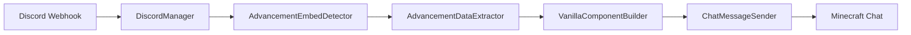

# Design Document: Discord Advancement Message Formatting

## Overview

This feature transforms Discord advancement embeds into vanilla-style Minecraft advancement messages within the VonixCore-Forge-1.20.1 mod. The system intercepts Discord webhook messages containing advancement embeds, extracts the relevant data, and reconstructs them as native Minecraft text components with proper formatting, colors, and hover effects that match vanilla advancement notifications.

The implementation extends the existing `DiscordManager.processJavacordMessage()` method to detect advancement embeds and convert them to `MutableComponent` objects that integrate seamlessly with Minecraft's chat system.

## Architecture

The advancement message formatting system follows a pipeline architecture:



### Component Responsibilities

- **AdvancementEmbedDetector**: Identifies advancement embeds by checking embed titles and structure
- **AdvancementDataExtractor**: Parses embed fields to extract player name, advancement title, and description
- **VanillaComponentBuilder**: Creates `MutableComponent` objects with vanilla advancement styling
- **ChatMessageSender**: Integrates formatted components into Minecraft's chat system

## Components and Interfaces

### AdvancementEmbedDetector

```java
public class AdvancementEmbedDetector {
    private static final Set<String> ADVANCEMENT_FOOTER_KEYWORDS = Set.of(
        "advancement", "goal", "challenge", "task"
    );
    
    public boolean isAdvancementEmbed(MessageEmbed embed);
    public AdvancementType getAdvancementType(MessageEmbed embed);
    private boolean hasAdvancementFooter(MessageEmbed embed);
}
```

### AdvancementDataExtractor

```java
public class AdvancementDataExtractor {
    public AdvancementData extractFromEmbed(MessageEmbed embed) throws ExtractionException;
}

public class AdvancementData {
    private final String playerName;
    private final String advancementTitle;
    private final String advancementDescription;
    private final AdvancementType type;
    
    // Constructor and getters
}
```

### VanillaComponentBuilder

```java
public class VanillaComponentBuilder {
    public MutableComponent buildAdvancementMessage(
        AdvancementData data, 
        String serverPrefix
    );
    
    private MutableComponent createHoverText(String description);
    private TextColor getAdvancementColor(AdvancementType type);
}
```

### Integration with DiscordManager

The existing `DiscordManager.processJavacordMessage()` method will be enhanced with advancement processing:

```java
public class DiscordManager {
    private final AdvancementEmbedDetector detector = new AdvancementEmbedDetector();
    private final AdvancementDataExtractor extractor = new AdvancementDataExtractor();
    private final VanillaComponentBuilder builder = new VanillaComponentBuilder();
    
    public void processJavacordMessage(Message message) {
        // Existing message processing logic...
        
        for (MessageEmbed embed : message.getEmbeds()) {
            if (detector.isAdvancementEmbed(embed)) {
                processAdvancementEmbed(embed, message);
                return; // Skip normal embed processing
            }
        }
        
        // Continue with normal processing...
    }
    
    private void processAdvancementEmbed(MessageEmbed embed, Message message) {
        try {
            AdvancementData data = extractor.extractFromEmbed(embed);
            String serverPrefix = getServerPrefix(message.getServer());
            MutableComponent component = builder.buildAdvancementMessage(data, serverPrefix);
            sendToMinecraftChat(component);
        } catch (ExtractionException e) {
            LOGGER.error("Failed to process advancement embed", e);
            // Fall back to normal embed processing
        }
    }
}
```

## Data Models

### AdvancementType Enumeration

```java
public enum AdvancementType {
    NORMAL("Advancement Made", ChatFormatting.YELLOW),
    GOAL("Goal Reached", ChatFormatting.YELLOW),
    CHALLENGE("Challenge Complete", ChatFormatting.LIGHT_PURPLE);
    
    private final String displayText;
    private final ChatFormatting color;
    
    AdvancementType(String displayText, ChatFormatting color) {
        this.displayText = displayText;
        this.color = color;
    }
}
```

### AdvancementData Class

```java
public class AdvancementData {
    private final String playerName;
    private final String advancementTitle;
    private final String advancementDescription;
    private final AdvancementType type;
    
    public AdvancementData(String playerName, String advancementTitle, 
                          String advancementDescription, AdvancementType type) {
        this.playerName = Objects.requireNonNull(playerName);
        this.advancementTitle = Objects.requireNonNull(advancementTitle);
        this.advancementDescription = Objects.requireNonNull(advancementDescription);
        this.type = Objects.requireNonNull(type);
    }
    
    // Getters with validation
}
```

### ExtractionException

```java
public class ExtractionException extends Exception {
    public ExtractionException(String message) {
        super(message);
    }
    
    public ExtractionException(String message, Throwable cause) {
        super(message, cause);
    }
}
```

## Correctness Properties

*A property is a characteristic or behavior that should hold true across all valid executions of a system-essentially, a formal statement about what the system should do. Properties serve as the bridge between human-readable specifications and machine-verifiable correctness guarantees.*

### Property 1: Advancement Embed Detection
*For any* Discord message containing embeds, all embeds with advancement-related footer text (containing keywords like "advancement", "goal", "challenge", "task") should be correctly identified as advancement embeds, and all other embeds should be classified as non-advancement embeds.
**Validates: Requirements 1.1, 1.2**

### Property 2: Complete Data Extraction
*For any* valid advancement embed, the extraction process should successfully retrieve all required fields (player name, advancement title, advancement description) and produce a complete AdvancementData object with non-empty values.
**Validates: Requirements 2.1, 2.2, 2.3, 2.5**

### Property 3: Multiple Embed Processing
*For any* Discord message containing multiple embeds, each advancement embed should be processed independently, and the total number of generated advancement messages should equal the number of advancement embeds in the original message.
**Validates: Requirements 1.4**

### Property 4: Vanilla Formatting Consistency
*For any* generated advancement component, the text formatting, colors, and structure should match the corresponding vanilla Minecraft advancement message format, including proper color coding for different advancement types and hover text containing the description.
**Validates: Requirements 3.1, 3.2, 3.3, 3.4, 3.5**

### Property 5: Server Identification
*For any* advancement message from a Discord server, the generated component should include a visually distinct server prefix that correctly identifies the source server and is configurable through the system settings.
**Validates: Requirements 4.1, 4.2, 4.3, 4.5**

### Property 6: Unique Server Prefixes
*For any* set of advancement messages from different Discord servers, each server should have a unique prefix that distinguishes it from all other servers in the same chat session.
**Validates: Requirements 4.4**

### Property 7: Chat Integration
*For any* successfully generated advancement component, it should be sent to the Minecraft chat system in the correct channel, replace the original Discord embed, and maintain proper message ordering without creating duplicates.
**Validates: Requirements 5.1, 5.2, 5.3, 5.4, 5.5**

### Property 8: Error Handling Resilience
*For any* malformed advancement embed or system error during processing, the Discord Manager should handle the error gracefully, log appropriate error messages, continue processing other messages, and maintain system stability without crashing.
**Validates: Requirements 2.4, 6.1, 6.2, 6.4, 6.5**

### Property 9: Fallback Behavior
*For any* advancement embed where data extraction fails, the system should fall back to displaying the original Discord embed instead of the converted message, ensuring no advancement notifications are lost.
**Validates: Requirements 6.3**

## Error Handling

The advancement message formatting system implements comprehensive error handling at multiple levels:

### Embed Detection Errors
- **Invalid Embed Structure**: If an embed lacks required fields or has unexpected structure, log warning and skip processing
- **Missing Title**: If embed title is null or empty, treat as non-advancement embed
- **API Access Errors**: If Javacord API calls fail, catch exceptions and continue with next embed

### Data Extraction Errors
- **Missing Fields**: If required embed fields are missing, throw `ExtractionException` with specific field information
- **Empty Values**: If extracted values are empty or whitespace-only, throw `ExtractionException`
- **Parsing Errors**: If field values cannot be parsed or contain invalid characters, log error and skip

### Component Generation Errors
- **Component Creation Failure**: If `MutableComponent` creation fails, log error and fall back to original embed
- **Styling Errors**: If text styling or color application fails, use default formatting
- **Hover Text Errors**: If hover text creation fails, create component without hover functionality

### Integration Errors
- **Chat System Errors**: If sending to Minecraft chat fails, log error but don't crash
- **Server Identification Errors**: If server prefix cannot be determined, use default prefix
- **Configuration Errors**: If server prefix configuration is invalid, use fallback configuration

### Error Recovery Strategy
1. **Graceful Degradation**: Always prefer showing something over showing nothing
2. **Fallback Chain**: Original embed → simplified component → error message
3. **Isolation**: Errors in processing one embed don't affect others
4. **Logging**: All errors logged with sufficient context for debugging

## Testing Strategy

The advancement message formatting feature requires comprehensive testing using both unit tests and property-based tests to ensure correctness across all possible inputs and edge cases.

### Unit Testing Approach

Unit tests focus on specific examples, edge cases, and integration points:

- **Embed Detection**: Test specific embed structures and title variations
- **Data Extraction**: Test known embed formats and field arrangements  
- **Component Generation**: Test specific advancement types and formatting
- **Error Conditions**: Test specific malformed inputs and error scenarios
- **Integration Points**: Test interaction with DiscordManager and chat system

### Property-Based Testing Configuration

Property-based tests verify universal properties across randomized inputs using **QuickTheories** for Java:

- **Minimum 100 iterations** per property test to ensure comprehensive coverage
- **Custom generators** for Discord embeds, advancement data, and server configurations
- **Shrinking support** to find minimal failing examples when tests fail
- **Tagged tests** referencing design document properties

Each property test must include a comment tag in the format:
**Feature: advancement-message-formatting, Property {number}: {property_text}**

### Test Data Generation Strategy

- **Embed Generators**: Create valid and invalid Discord embeds with various field combinations
- **String Generators**: Generate player names, advancement titles, and descriptions with edge cases
- **Server Generators**: Create different server configurations and prefix formats
- **Error Generators**: Generate various error conditions and malformed inputs

### Integration Testing

- **End-to-End Flow**: Test complete pipeline from Discord webhook to Minecraft chat
- **Multi-Server Scenarios**: Test advancement messages from multiple Discord servers
- **Concurrent Processing**: Test handling of multiple simultaneous advancement messages
- **Configuration Changes**: Test dynamic configuration updates during runtime

The dual testing approach ensures both concrete correctness (unit tests) and universal correctness (property tests), providing comprehensive validation of the advancement message formatting system.