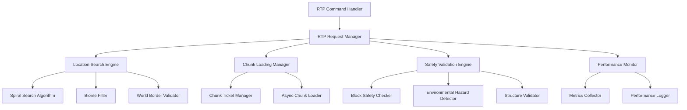

# Design Document: RTP Performance Optimization

## Overview

This design optimizes VonixCore's Random Teleport (RTP) functionality to match the performance standards of leading Forge 1.20.1 RTP mods like FastRTP, AsyncRTP Renewed, and RTP. The optimization focuses on eliminating lag through asynchronous processing, efficient chunk management, intelligent location finding algorithms, and comprehensive safety validation.

Key design principles:
- **Zero main thread blocking**: All heavy operations run asynchronously
- **Efficient chunk management**: Temporary chunk tickets with automatic cleanup
- **Intelligent location search**: Spiral search patterns with biome filtering
- **Comprehensive safety validation**: Multi-layered safety checks
- **Resource optimization**: Memory-conscious caching and thread pool management

## Architecture

The optimized RTP system follows a layered architecture with clear separation of concerns:



**Core Components:**

1. **RTP Request Manager**: Orchestrates the entire RTP process using CompletableFuture chains
2. **Location Search Engine**: Implements optimized search algorithms with configurable parameters
3. **Chunk Loading Manager**: Handles asynchronous chunk loading with temporary tickets
4. **Safety Validation Engine**: Performs comprehensive safety checks on potential locations
5. **Performance Monitor**: Tracks metrics and ensures performance thresholds are met

## Components and Interfaces

### RTP Request Manager

**Purpose**: Central orchestrator for RTP operations, managing the complete workflow from request to teleportation.

**Key Methods**:
```java
public interface RTPRequestManager {
    CompletableFuture<RTPResult> processRTPRequest(Player player, RTPOptions options);
    CompletableFuture<Location> findSafeLocation(World world, RTPSearchParams params);
    void cancelRTPRequest(UUID playerId);
    RTPStatus getRTPStatus(UUID playerId);
}
```

**Implementation Strategy**:
- Uses CompletableFuture chains for non-blocking operations
- Implements request queuing with configurable concurrency limits
- Provides cancellation support for long-running operations
- Maintains per-player request state tracking

### Location Search Engine

**Purpose**: Implements intelligent algorithms for finding safe teleportation locations efficiently.

**Search Algorithm**: Spiral search pattern starting from a random center point, expanding outward in configurable increments.

**Key Features**:
- **Biome filtering**: Skip expensive chunk loads for blacklisted biomes
- **Distance constraints**: Respect minimum and maximum teleport distances
- **World border awareness**: Ensure locations are within world boundaries
- **Retry logic**: Automatic retry with expanded search radius on failure

**Search Pattern**:
```java
public class SpiralSearchAlgorithm {
    private static final int[] SPIRAL_X = {0, 1, 0, -1};
    private static final int[] SPIRAL_Z = {1, 0, -1, 0};
    
    public CompletableFuture<List<Location>> searchLocations(
        World world, 
        Location center, 
        int radius, 
        int maxAttempts
    );
}
```

### Chunk Loading Manager

**Purpose**: Manages asynchronous chunk loading with temporary tickets and automatic cleanup.

**Chunk Ticket Strategy**:
- **Temporary tickets**: Use `ChunkTicketType.TEMPORARY` with 30-second expiration
- **Ticket pooling**: Reuse tickets for chunks requested by multiple operations
- **Automatic cleanup**: Background task removes expired tickets every 10 seconds
- **Load balancing**: Distribute chunk loading across multiple threads

**Implementation**:
```java
public class ChunkLoadingManager {
    private final Map<ChunkPos, ChunkTicket> activeTickets = new ConcurrentHashMap<>();
    private final ScheduledExecutorService cleanupExecutor;
    
    public CompletableFuture<Chunk> loadChunkAsync(World world, ChunkPos pos);
    public void releaseChunkTicket(ChunkPos pos);
    private void cleanupExpiredTickets();
}
```

### Safety Validation Engine

**Purpose**: Performs comprehensive safety checks on potential teleportation locations.

**Validation Layers**:

1. **Block Safety Validation**:
   - Ensure 2-block vertical clearance above target location
   - Verify solid ground beneath teleport position
   - Check for suffocation risks (solid blocks at head/feet level)

2. **Environmental Hazard Detection**:
   - Scan 3-block radius for lava, fire, magma blocks
   - Detect cactus and other damage-dealing blocks
   - Check for void proximity (Y < 5 in Overworld)

3. **Structure Validation** (configurable):
   - Avoid or prefer specific structure types
   - Respect structure-based teleport restrictions
   - Handle dimension-specific structure rules

**Safety Check Implementation**:
```java
public class SafetyValidationEngine {
    public CompletableFuture<SafetyResult> validateLocation(Location location) {
        return CompletableFuture
            .supplyAsync(() -> checkBlockSafety(location))
            .thenCompose(result -> checkEnvironmentalHazards(location, result))
            .thenCompose(result -> checkStructureConstraints(location, result));
    }
}
```

### Performance Monitor

**Purpose**: Tracks performance metrics and ensures RTP operations meet performance requirements.

**Monitored Metrics**:
- Main thread impact (must be < 1ms per operation)
- Chunk loading time (target < 2 seconds per chunk)
- Location search time (target < 5 seconds for 95% of requests)
- Memory usage per RTP operation
- Queue depth and processing rate

**Performance Thresholds**:
```java
public class PerformanceThresholds {
    public static final long MAX_MAIN_THREAD_TIME_MS = 1;
    public static final long MAX_CHUNK_LOAD_TIME_MS = 2000;
    public static final long MAX_LOCATION_SEARCH_TIME_MS = 5000;
    public static final int MAX_QUEUE_DEPTH = 100;
    public static final long MAX_MEMORY_PER_OPERATION_MB = 10;
}
```

## Data Models

### RTP Request Model

```java
public class RTPRequest {
    private final UUID playerId;
    private final UUID requestId;
    private final World targetWorld;
    private final RTPOptions options;
    private final long timestamp;
    private volatile RTPStatus status;
    private volatile Location result;
    private volatile String failureReason;
}
```

### RTP Options Model

```java
public class RTPOptions {
    private final int minRadius;
    private final int maxRadius;
    private final Set<String> allowedBiomes;
    private final Set<String> blockedBiomes;
    private final boolean respectWorldBorder;
    private final int safetyCheckRadius;
    private final int maxSearchAttempts;
    private final long searchTimeoutMs;
}
```

### Location Validation Result

```java
public class SafetyResult {
    private final boolean isSafe;
    private final Location location;
    private final List<SafetyIssue> issues;
    private final double safetyScore;
    
    public enum SafetyIssue {
        SUFFOCATION_RISK,
        FALL_DAMAGE_RISK,
        LAVA_NEARBY,
        FIRE_NEARBY,
        VOID_PROXIMITY,
        UNSTABLE_GROUND,
        STRUCTURE_CONFLICT
    }
}
```

### Performance Metrics Model

```java
public class RTPMetrics {
    private final long requestId;
    private final long startTime;
    private final long endTime;
    private final long chunkLoadTime;
    private final long locationSearchTime;
    private final long safetyValidationTime;
    private final int chunksLoaded;
    private final int locationsChecked;
    private final boolean successful;
    private final String failureReason;
}
```

Now I need to use the prework tool to analyze the acceptance criteria before writing the Correctness Properties section:

<function_calls>
<invoke name="prework">
<parameter name="featureName">rtp-performance-optimization

## Correctness Properties

*A property is a characteristic or behavior that should hold true across all valid executions of a system—essentially, a formal statement about what the system should do. Properties serve as the bridge between human-readable specifications and machine-verifiable correctness guarantees.*

### Property 1: Server Performance Preservation
*For any* RTP request processed by the system, the server TPS should remain above 19.5 and main thread impact should not exceed 1ms per operation.
**Validates: Requirements 1.1, 1.4**

### Property 2: Non-blocking Request Processing
*For any* set of concurrent RTP requests, the main server thread should remain responsive and process other game logic without blocking.
**Validates: Requirements 1.2**

### Property 3: Asynchronous Chunk Loading Performance
*For any* chunk loading operation required by RTP, the operation should complete asynchronously without impacting server performance metrics.
**Validates: Requirements 1.3**

### Property 4: Chunk Lifecycle Management
*For any* chunk loaded for RTP validation, the system should use temporary tickets that expire automatically within 30 seconds of validation completion, and reuse existing tickets when multiple requests target the same chunk.
**Validates: Requirements 2.1, 2.2, 2.3**

### Property 5: Graceful Chunk Loading Failure Handling
*For any* chunk loading operation that fails or times out, the system should handle the failure gracefully and attempt alternative locations without crashing or hanging.
**Validates: Requirements 2.4**

### Property 6: Location Search Performance and Success Rate
*For any* location search operation, the system should find valid locations within 5 seconds for at least 95% of requests.
**Validates: Requirements 3.1**

### Property 7: Safety Validation Rejection and Continuation
*For any* unsafe location encountered during search, the safety validator should reject it and continue searching without delay or interruption.
**Validates: Requirements 3.2**

### Property 8: Adaptive Search Radius Expansion
*For any* location search that fails to find safe locations in the primary search area, the search radius should expand automatically to increase success probability.
**Validates: Requirements 3.3**

### Property 9: Comprehensive Safety Validation
*For any* location being validated for teleportation, the safety validator should check for all specified hazards (lava, void, suffocation, fall damage) and ensure 2-block vertical clearance, solid ground, and compliance with world boundaries and structure constraints.
**Validates: Requirements 3.4, 8.1, 8.2, 8.3, 8.4, 8.5**

### Property 10: Biome Filter Compliance
*For any* location search with configured biome restrictions, only locations in allowed biomes should be selected, and blacklisted biomes should be completely avoided.
**Validates: Requirements 3.5**

### Property 11: Thread Pool Behavior and Scaling
*For any* thread pool configuration and load scenario, the pool should use the configured number of worker threads, scale appropriately between minimum and maximum sizes based on load, and return threads to the pool immediately upon operation completion.
**Validates: Requirements 4.1, 4.2, 4.3, 4.4**

### Property 12: Memory Usage Optimization
*For any* RTP operation, memory usage should stay within configured limits per operation, implement proper cache eviction policies, release chunk data references immediately after validation, and apply backpressure when queue depth grows large.
**Validates: Requirements 5.1, 5.2, 5.3, 5.4**

### Property 13: Configuration System Validation
*For any* configuration option (distance limits, thread pool sizes, timeouts, biome filters, cooldowns), the system should properly apply the configured values and respect all configuration constraints during operation.
**Validates: Requirements 6.1, 6.2, 6.3, 6.4, 6.5, 6.6, 6.7**

### Property 14: Performance Monitoring and Metrics Collection
*For any* completed RTP operation, the performance monitor should log all specified metrics (execution time, chunk loading time, location search time) and generate appropriate warnings when thresholds are exceeded.
**Validates: Requirements 7.1, 7.2, 7.3, 7.4**

### Property 15: Configuration Migration and Backward Compatibility
*For any* upgrade from existing AsyncRtpManager implementation, configuration values should migrate automatically, existing commands should maintain the same interface and behavior, and public API methods should remain backward compatible.
**Validates: Requirements 10.1, 10.2, 10.4**

## Error Handling

The RTP system implements comprehensive error handling at multiple levels:

### Request Level Error Handling
- **Invalid parameters**: Validate all input parameters and return descriptive error messages
- **Permission failures**: Check player permissions before processing requests
- **Cooldown violations**: Enforce cooldown periods and provide clear feedback
- **World access issues**: Handle cases where target worlds are unavailable

### Chunk Loading Error Handling
- **Chunk loading timeouts**: Implement configurable timeouts with fallback to alternative locations
- **Memory pressure**: Apply backpressure when chunk loading consumes excessive memory
- **Concurrent access conflicts**: Handle race conditions in chunk ticket management
- **World generation failures**: Gracefully handle world generation errors during chunk loading

### Location Search Error Handling
- **No safe locations found**: Expand search radius and retry with different parameters
- **Search timeouts**: Implement configurable search timeouts with graceful degradation
- **Biome filter conflicts**: Handle cases where biome restrictions make location finding impossible
- **World border constraints**: Respect world borders and handle edge cases near boundaries

### Safety Validation Error Handling
- **Block access failures**: Handle cases where block data cannot be accessed
- **Structure detection errors**: Gracefully handle structure detection failures
- **Environmental hazard edge cases**: Handle complex scenarios with multiple overlapping hazards
- **Validation timeouts**: Implement timeouts for safety validation operations

### Thread Pool Error Handling
- **Thread pool exhaustion**: Implement queue limits and backpressure mechanisms
- **Thread interruption**: Handle thread interruption gracefully during long operations
- **Executor shutdown**: Properly handle executor shutdown during server shutdown
- **Resource cleanup**: Ensure proper cleanup of thread pool resources

## Testing Strategy

The RTP performance optimization employs a dual testing approach combining unit tests for specific scenarios and property-based tests for comprehensive validation.

### Unit Testing Focus Areas

**Specific Examples and Edge Cases**:
- Configuration parsing with various valid and invalid formats
- Command handling with different parameter combinations
- Error message formatting and localization
- Integration points between components
- Specific safety validation scenarios (e.g., player spawning in lava)

**Integration Testing**:
- End-to-end RTP request processing
- Chunk loading and unloading workflows
- Performance monitoring integration
- Configuration migration scenarios

### Property-Based Testing Configuration

**Testing Framework**: Use QuickCheck for Java or similar property-based testing library
**Test Configuration**: Minimum 100 iterations per property test to ensure comprehensive coverage
**Test Tagging**: Each property test must reference its design document property

**Property Test Implementation Requirements**:
- Each correctness property must be implemented by a single property-based test
- Tests must generate random valid inputs to verify universal properties
- Tests must include appropriate generators for RTP-specific data types
- Tests must validate both positive and negative cases where applicable

**Example Property Test Structure**:
```java
@Property
@Tag("Feature: rtp-performance-optimization, Property 1: Server Performance Preservation")
void rtpRequestsShouldPreserveServerPerformance(
    @ForAll("validRtpRequests") RTPRequest request
) {
    // Test implementation
}
```

**Generator Requirements**:
- **RTP Request Generator**: Generate valid RTP requests with various parameters
- **Location Generator**: Generate world locations within valid ranges
- **Configuration Generator**: Generate valid configuration combinations
- **World State Generator**: Generate various world states for testing

**Performance Testing Integration**:
- Property tests must include performance assertions where applicable
- Memory usage must be monitored during property test execution
- Thread safety must be validated through concurrent property test execution
- Timeout handling must be tested with configurable timeout values

**Test Data Management**:
- Use temporary test worlds for location validation testing
- Clean up test resources after each property test execution
- Mock external dependencies (e.g., chunk loading) where appropriate for unit testing
- Use real chunk loading for integration and performance testing